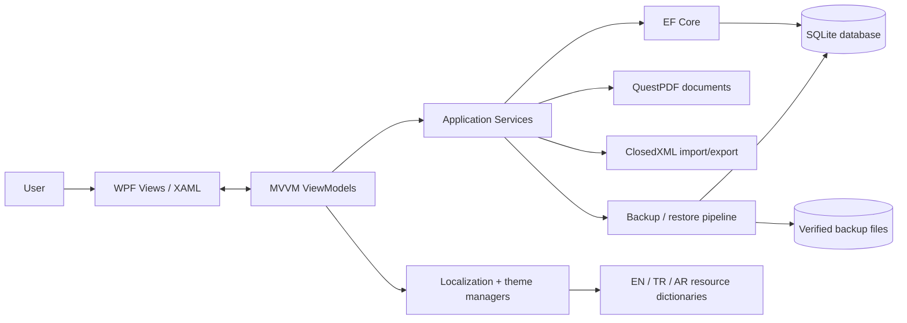

# KARZOUN ERP architecture

KARZOUN ERP is a standalone Windows desktop application. Its architecture favors a clear local trust boundary: WPF presents the UI, MVVM view models coordinate user intent, services own business/document/recovery workflows, and Entity Framework Core persists local state to SQLite.

## System view



## Engineering boundaries

| Concern | Current behavior |
| --- | --- |
| Deployment model | Single-machine Windows desktop application with no required server or account. |
| UI architecture | WPF/XAML views are separated from behavior through MVVM view models and services. |
| Persistence | EF Core 8 stores local business state in SQLite under the current user's application-data directory. |
| Localization | English, Turkish, and Arabic strings live in separate resource dictionaries; Arabic switches the UI to RTL. |
| Company-specific configuration | Localized document defaults and per-company appearance overrides are persisted separately from global settings. |
| Document generation | Quotations/invoices are rendered through QuestPDF; Excel import/export and sales reports use ClosedXML. |
| Data migration | Startup schema updates preserve existing local data and migrate localized company settings into language-specific rows. |
| Backup integrity | Restore candidates are verified, migrated in a temporary copy, verified again, and only then applied. |
| Recovery | Restore takes an emergency backup and supports rollback; startup recovery preserves a corrupted database before selecting a verified safety backup. |
| Release integrity | Published installers include SHA-256 checksum material for manual verification. |
| Validation | Windows CI restores/builds the .NET 8 project and CodeQL analyzes C# with security-extended queries. |
| Supply chain | Third-party GitHub Actions used by CI and CodeQL are pinned to reviewed immutable commits. |

## Request and persistence flow

```text
User action
   |
   v
WPF View
   |
   v
ViewModel command / state
   |
   v
Domain-oriented service
   |
   +----> EF Core ----> SQLite
   |
   +----> PDF / Excel workflow
   |
   +----> backup / recovery workflow
```

Views do not need to know how SQLite, document rendering, or backup verification work. Those concerns remain behind services and helpers so UI behavior can evolve without moving persistence/recovery logic into XAML code-behind.

## Localization and RTL boundary

UI strings are maintained in `Resources/Strings.en.xaml`, `Resources/Strings.tr.xaml`, and `Resources/Strings.ar.xaml`. The application language determines both resource selection and layout direction. Arabic switches flow direction, text/grid alignment, and relevant spacing while Turkish and English remain LTR.

Company document defaults are language-aware. `CompanyLocalizedSettings` stores one row per company/language for invoice notes, quotation notes, legal footer text, payment details, and QR template text. A unique `(CompanyId, LanguageCode)` constraint prevents duplicate language configurations.

The startup migration path seeds/migrates these localized settings from older shared company fields so the localization feature does not require discarding existing user configuration.

## Backup and restore safety

The restore path is intentionally more defensive than a raw file replacement:

1. validate the selected SQLite backup;
2. migrate a temporary copy to the current schema;
3. validate the migrated copy again;
4. create an emergency backup of the live database;
5. apply the verified replacement;
6. roll back to the emergency copy if application fails.

Startup recovery also preserves a detected corrupted database before restoring from a verified safety backup. This keeps failure evidence available instead of silently overwriting it.

## Trust boundary

KARZOUN ERP is local-first in deployment rather than a network service. There is no server-side authentication/authorization boundary in the current architecture because there is no shared server or remote account system. The operating-system user account and filesystem permissions form the primary local access boundary.

This means the project should not be evaluated as a multi-user SaaS security model. A future synchronized/server edition would require separate authentication, authorization, transport security, conflict handling, audit, and server-side tenancy boundaries.

## Explicit non-claims

The current application does not claim:

- multi-user concurrent database access across machines;
- server-side RBAC or remote account security;
- cloud synchronization or distributed consistency;
- regulated accounting certification;
- that local backups replace an organization-wide disaster-recovery plan.

Those are intentionally outside the standalone desktop scope.
